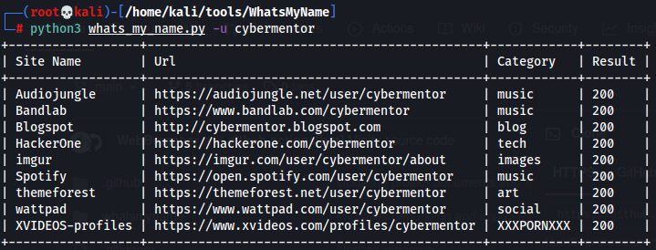
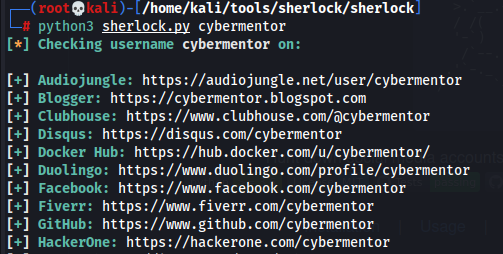

Para realizar la busqueda de usuarios podemos utilizar las tools en kali. 
Estos buscan en varios de sitios donde se pueden registrar y verifica si existen los usuarios buscados.

https://github.com/C3n7ral051nt4g3ncy/WhatsMyName-Python
USO: whatsmyname -u "usuario"

==========================================================

https://github.com/sherlock-project/sherlock
USO: sherlock "usuario"

==========================================================

Con usersearch.ai podemos buscar informacion acerca de muchas cosas, tiene la version gratuita y la de pago.
https://usersearch.ai/

