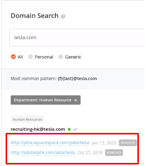
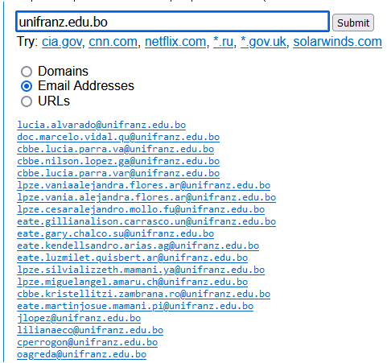
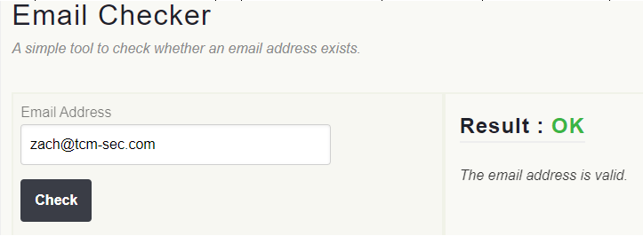

Hunter.io
=========

Para poder encontrar los correos de personas o empresas que estemos buscando podemos hacerlo con las siguientes herramientas.
https://hunter.io, necesitamos crearnos una cuenta  verificarla para que este activa, luego hacemos las busquedas

============================================================

Phonebook.cz
============

Otra opcion es phonebook.cz --> https://phonebook.cz/ (necesitamos crear una cuenta)

============================================================

Clearbit (extension)
============

Otra opcion mas es clearbit que es una extencion para chrome que nos permite buscar emails de las empresas https://chrome.google.com/webstore/detail/clearbit-connect-free-ver/pmnhcgfcafcnkbengdcanjablaabjplo/related
esto tiene la limitante que tiene su version gratuita pero limitada a la cantidad de correos que puede dejarnos ver

============================================================

Email-Checker
============

Ahora podemos recolectar mucho emails pero para saber si estan validos para enviar correos podemos hacerlo con https://email-checker.net/check (sin la necesidad de crear una cuenta) o https://www.emailhippo.com/ (despues de crearnos una cuenta)

