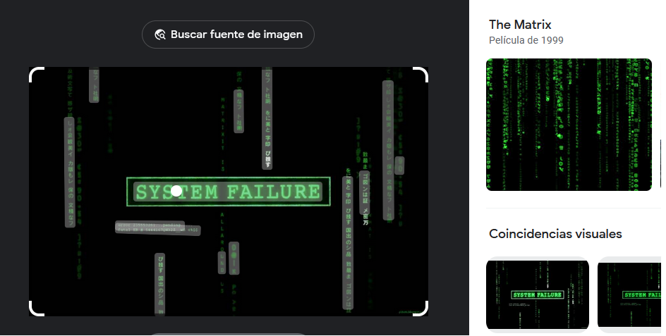
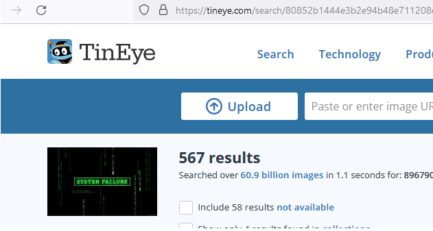
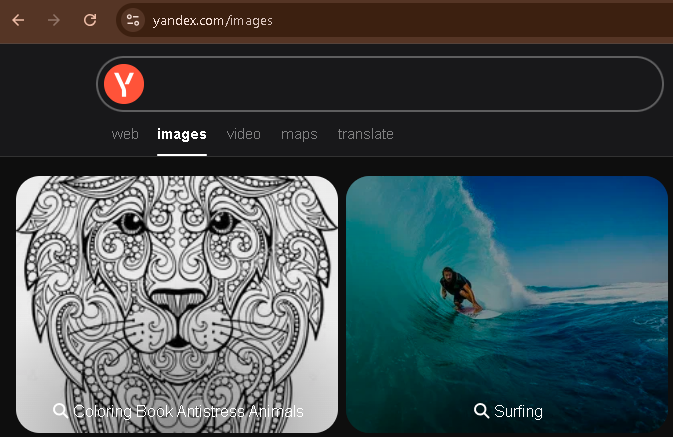

Google Images
=============

Para poder buscar informacion teniendo una imagen podemos hacerlo con varias herramientas, la primera y gratuita con google
https://images.google.com/

=============================================================

TinEye
======

Tineye es otra opcion gratuita para buscar en internet --> https://tineye.com/

=============================================================

Yandex
======

Otra fuente es yandex --> https://yandex.com/images/

