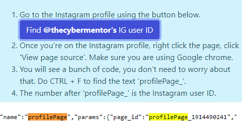
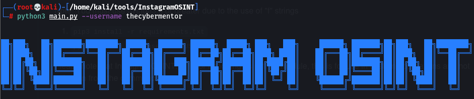

Al igual que en otras redes sociales lo principal es poder recolectar informacion viendo las publicaciones de las personas que se estan investigando y podemos a la vez ayudarnos con otras paginas utiles como las siguientes.
https://codeofaninja.com en donde encontramos el user ID de un usuario de instagram.

Tambien tenemos otras paginas en las que podemos encontrar informacion

-> Informacion acerca de una cuenta.

https://instadp.com 

Podemos descargar las imagenes de una cuenta incluso aunque en la aplicacion de instagram este deshabilitado.

https://imginn.com 

=============================================================
Instagramosint lo podemos encontrar en github y nos sirve tambien para recolectar informacion de instagram
https://github.com/sc1341/InstagramOSINT

