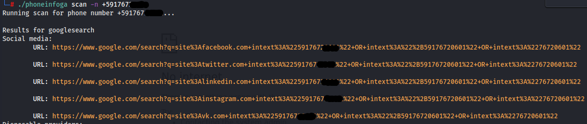
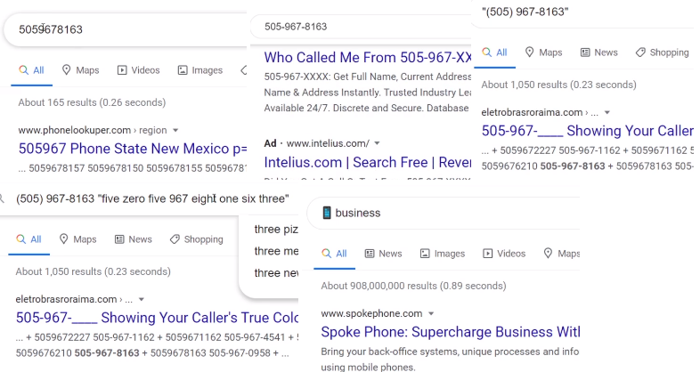

PhoneInfoga
===========

Con la herramienta phoneinfoga podemos realizar la busqueda de informacion de numeros de telefono.

USO: ./phoneinfoga scan -n +591 77777777

Para ver en modo grafico la tool hacemos:

phoneinfoga server -p 8080 y abrimos el navegador en localhost:8080 y obtenemos la version GUI.

============================================================

Mediante Google Hacking
=======================
Para buscar numero de telefono en google podemos usar variaciones para poder encontrarlos.

============================================================

Infobel
=======

https://infobel.com/

============================================================

Otros
=====

Otros sitios donde podemos encontrar resultados en base a numeros de telefono

TrueCaller - https://www.truecaller.com/

CallerID Test - https://calleridtest.com/
