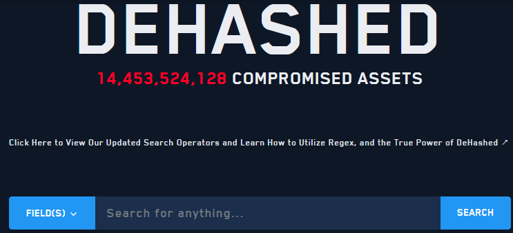
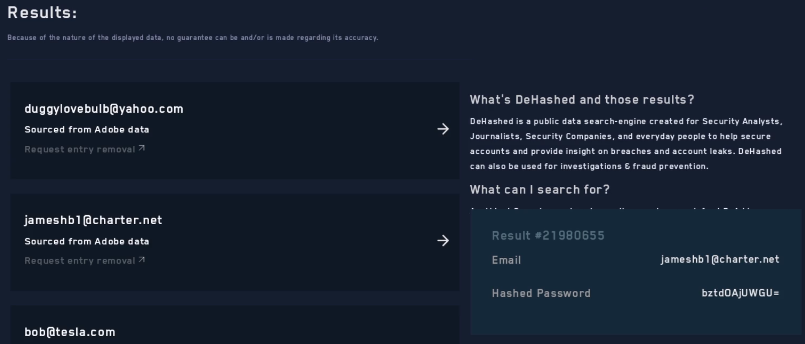

Dehashed
========

Vemos la forma de recuperar contraseñas que han sido parte de breaches de seguridad.
Primero y aunque de pago es una buena opcion consultar en dehashed.com

==========================================================

Otras fuentes
=============

Ojo con estas paginas en relacion a ganar informacion sobre los leaks de correos o usuarios
WeLeakInfo - https://weleakinfo.to/v2/

LeakCheck - https://leakcheck.io/

SnusBase - https://snusbase.com/

Scylla.sh - https://scylla.sh/

HaveIBeenPwned - https://haveibeenpwned.com/
