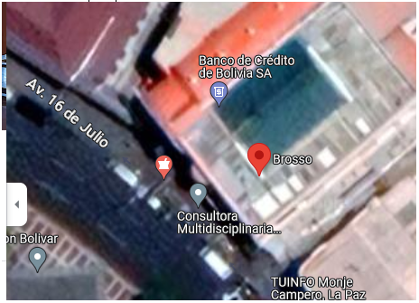
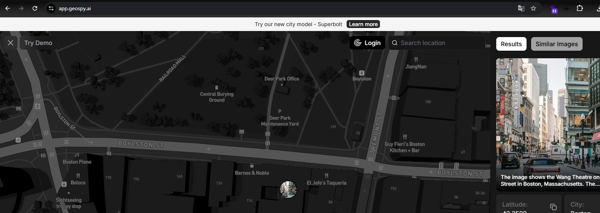
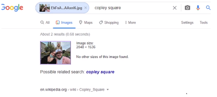

Google Maps
===========

Para poder encontrar una ubicacion de forma exacta utilizamos herramientas como google maps donde podemos visualizar el sitio con mayor exactitud
Presionando "capas" podemos tener una vista diferente

Y poniendo street view podemos ir a nivel de la calle.

========================================================================

GeoSpy
======

Tambien podemos usar app.geospy.ai que encuentra lugares utilizando inteligencia artificial.

Nota
====

Cuando no podemos reconocer la ubicacion, no tenemos datos EXIF u otra informacion podemos buscar basicamente necesitamos prestar atencion a los pequeños detalles que nos puede brindar una imagen para poder observar carteles, nombres de calles, hoteles etc. que nos puedan brindar datos de la ubicacion.

