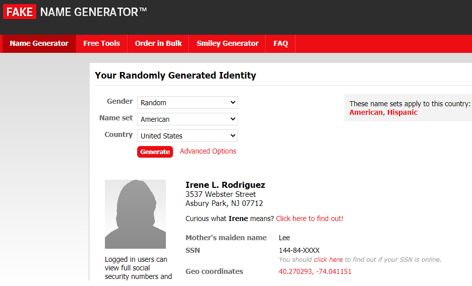

Un sock puppet es una "persona" o identidad que no existe en realidad que nos permite realizar busquedas OSINT sin ser descubiertos
1. Para empezar necesitamos la informacion de nuestro sock puppet, para esto podemos obtener una identidad random desde https://fakenamegenerator.com y crear a nuestro puppet.

2. Desde https://thispersondoesnotexist.com podemos obtener imagenes de personas creadas por IA que no existen en realidad.

3. En https://privacy.com podemos crear tarjetas de credito.

