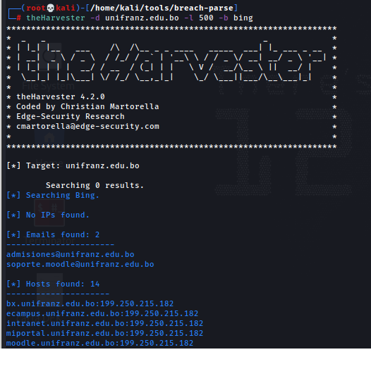
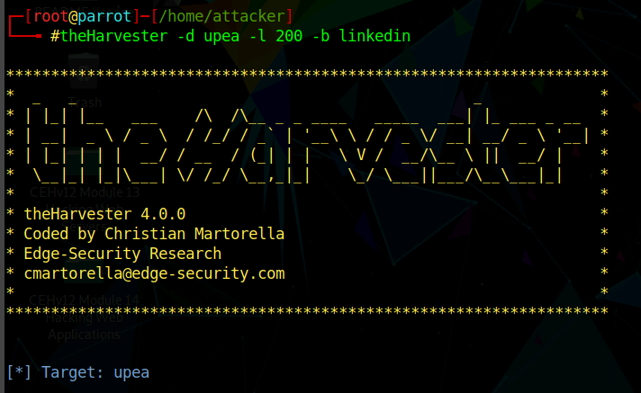
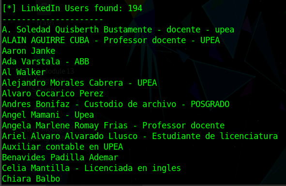
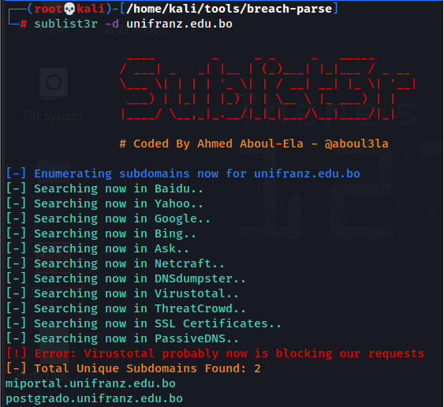
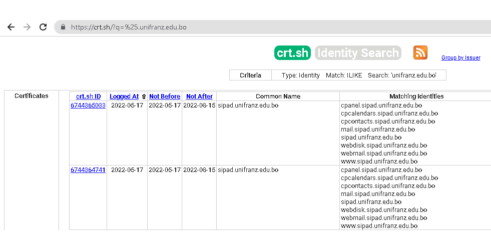
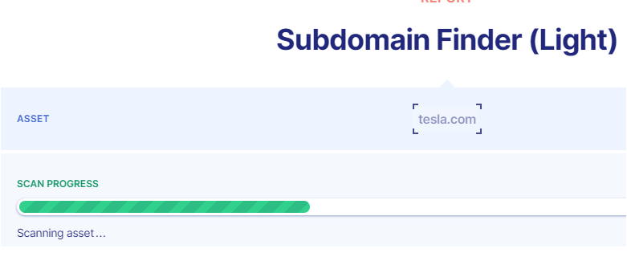
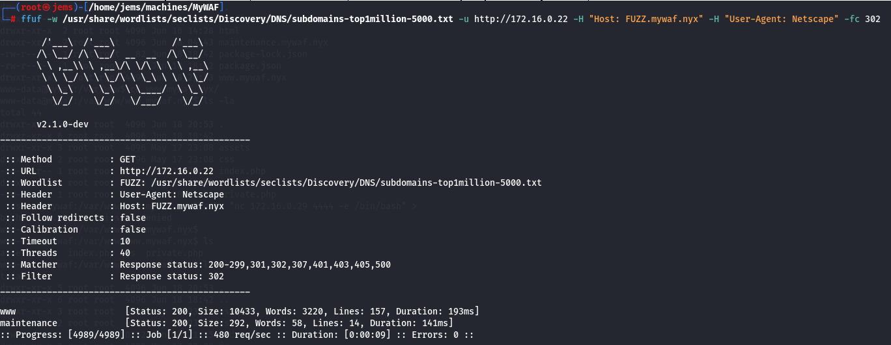

TheHarvester
============

Por medio de esta herramienta podemos encontrar correos, subdominios e informacion disponible de un dominio.

Ojo, google ya no esta disponible como source, ver theHarvester -h

Buscamos usuarios en linkedin que pertenezcan a una empresa

=========================================================================

Sublist3r
==========

Con sublist3r podemos realizar la busqueda de subdominios como theHarvester

=========================================================================

Crt.sh
==========

Busqueda de subdominios online, los resultados son mas interesantes que los obtenidos con sublist3r a momento.

=========================================================================

PentestTools
===========

Por medio de la pagina https://pentest-tools.com/information-gathering/find-subdomains-of-domain podemos tambien encontrar los subdominios de una pagina web.

=========================================================================

Ffuf
===========

Para buscar subdominios con ffuf hacemos
ffuf -w /usr/share/wordlists/seclists/Discovery/DNS/ subdomains-top1million-110000.txt -u http://10.0.2.6 -H "Host: FUZZ.mywaf.nyx" -H "User-Agent: Netscape" -fc 302

