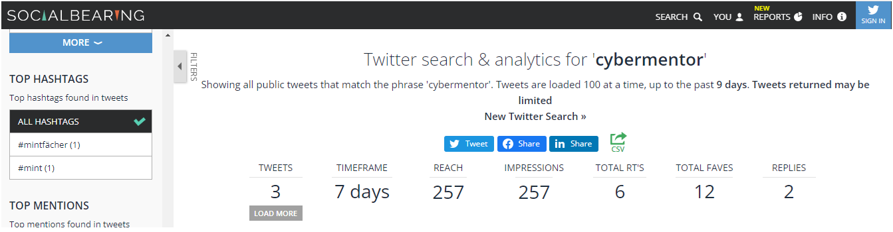

Para poder realizar OSINT en twitter
==================================== 
Podemos utilizar en el buscador palabras claves como en google hacking
"from:" "to:" "geocode:", entre otros que nos permiten encontrar los twits de las personas o palabras especificas que se hayan utilizado.
Por otra parte tambien existe el buscador avanzado que podemos utilizar en modo grafico que nos ayuda a encontrar los twits de manera mas rapida.

Busqueda FROM:


Busqueda TO:


Busquedas avanzadas en Twitter


===========================================================================================

TWINT
=====
Con esta herramienta buscar informacion acerca de twits realizados por un usuario y filtrar por contenido (por ejemplo)


Si tenemos errores en la instalacion luego de haberlo instalado de github hacemos lo siguiente
 
```pip3 install --upgrade -e git+https://github.com/twintproject/twint.git@origin/master#egg=twint```</pre>
 
```pip3 install --upgrade aiohttp_socks```


Y con esto ya podemos utilizar twint.

============================================================================================

Tambien podemos buscar informacion en las siguinentes paginas:
=============================================================
-> https://socialbearing.com Podemos encontrar la informacion publicada en twitter, estadisticas, colaboradores, etc. en la pagina.

-> https://twitonomy.com Aqui podemos ver los tiempos en los que se publican mas.

-> https://analytics.mentionmapp.com Podemos ver estilo maltego las personas que estan relacionadas en la cuenta de twitter.

-> https://tweetbeaver.com Entontramos mas informacion acerca de una cuenta de twitter. Entre esto conversaciones realizadas con otros usuarios.

-> https://spoonbill.io/twitter/data Podemos encontrar los cambios que se han realizado en la cuenta de twitter por ejemplo cambiar el nombre de la biografia.

-> https://tinfoleak.com Quienes le mencionaron, hasthtags, etc.

-> https://tweetdeck.twitter.com/ --> Informacion para hacer seguimiento a los twits realizados.


