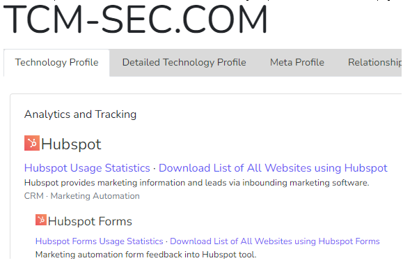
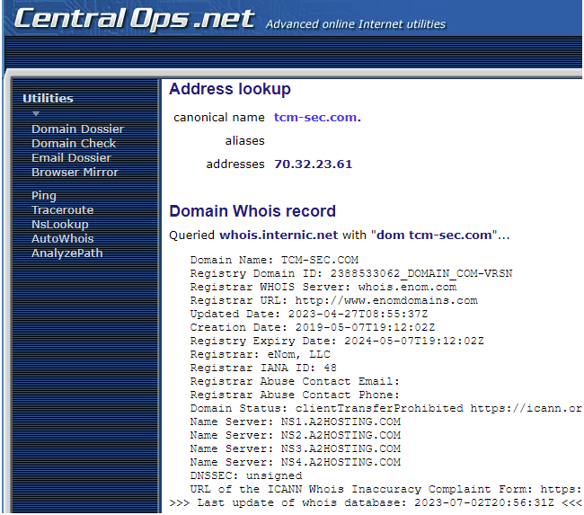
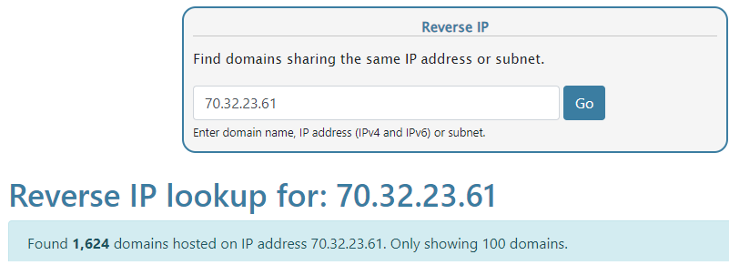
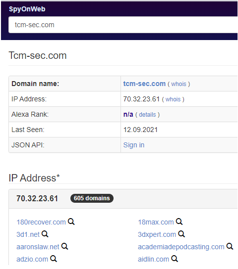
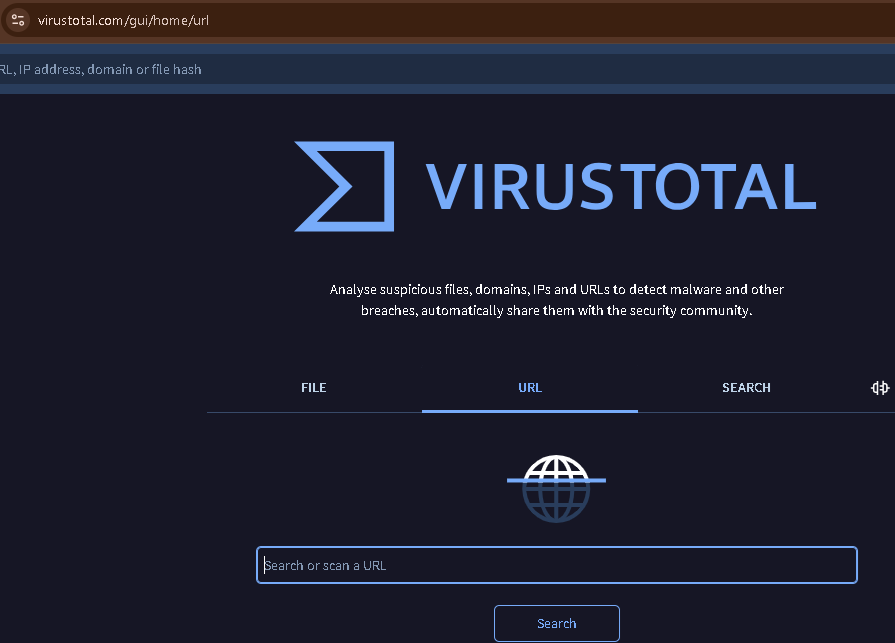
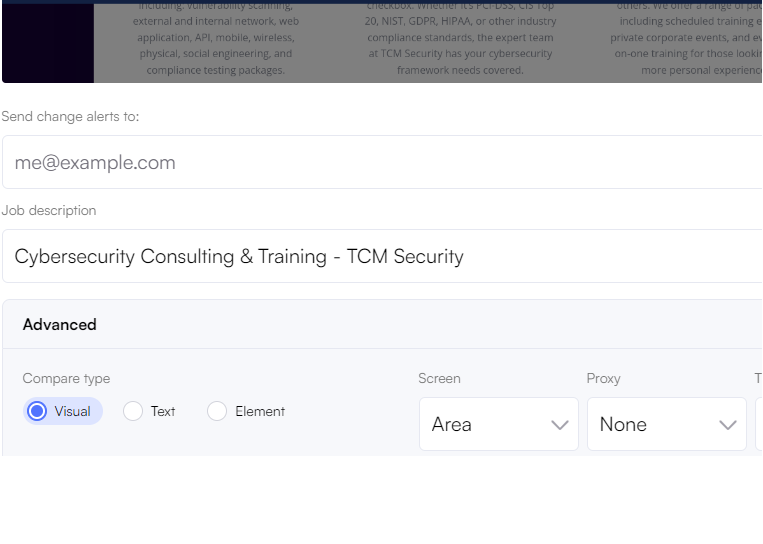
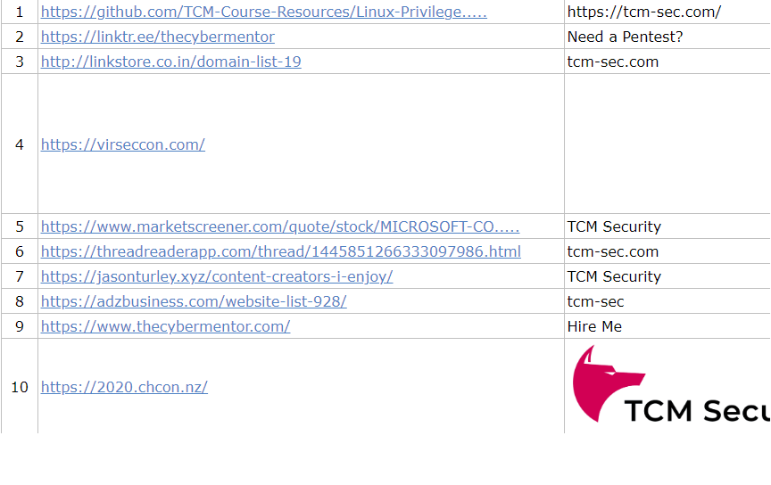

Builtwith
=========

Como pasa mucho google es nuestor principal amigo para hacer busquedas que nos permitan recolectar informacion de internet y ademas de esto podemos utilizar estas otras paginas utiles
BuiltWith - https://builtwith.com/ --> Para detectar las tecnologias que estan corriendo en una pagina

====================================================================

Centralops
==========

Domain Dossier - htps://centralops.net/co/ ---> Informacion de WHOIS completa

====================================================================

DnsLytics
==========

DNSlytics - https://dnslytics.com/reverse-ip --> Nos muestra los dominios que estan ligados a esta IP

====================================================================

SpyOnWeb
==========

SpyOnWeb - https://spyonweb.com/ --> Nos muestra resultados de whois, dominios relacionados y datos dns

====================================================================

VirusTotal
==========

Virus Total - https://www.virustotal.com/ --> Podemos escanerar paginas web en busca de elementos maliciosos

====================================================================

VisualPing
==========

Visual Ping - https://visualping.io/ --> Lo que hace es que busca cambios en las paginas web indicadas

====================================================================

BackLinkWatch
===========

Back Link Watch - http://backlinkwatch.com/index.php --> Busca los resultados de busquedas o menciones de esta pagina en otras paginas.

====================================================================

ViewDNS
===========

View DNS - https://viewdns.info/ --> Busquedas de DNS

