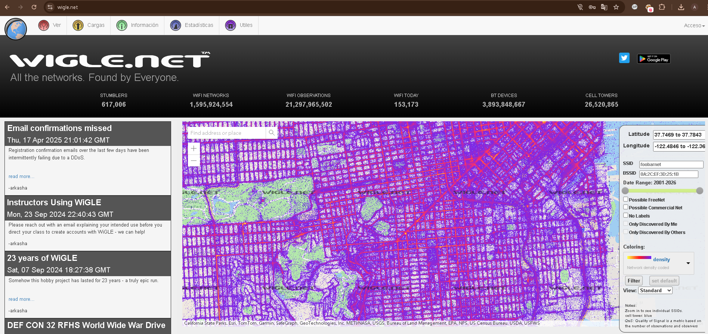

En la pagina wigle.net podemos realizar las busquedas de aparatos inalambricos que se encuentran en la zona indicada, para poder tener mayor informacion sobre los dispositivos necesitamos registrarnos y podremos acceder a informacion como MAC address, SSID, seguridad y otros.
https://wigle.net

Buscando una zona en particular

