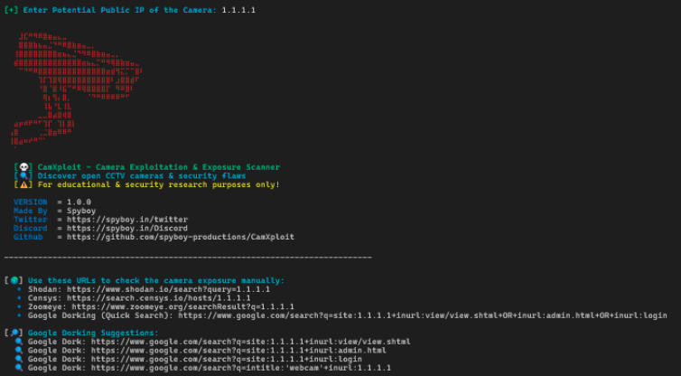
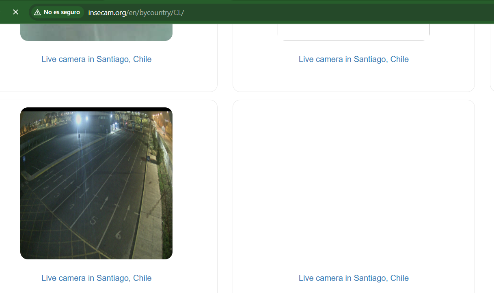
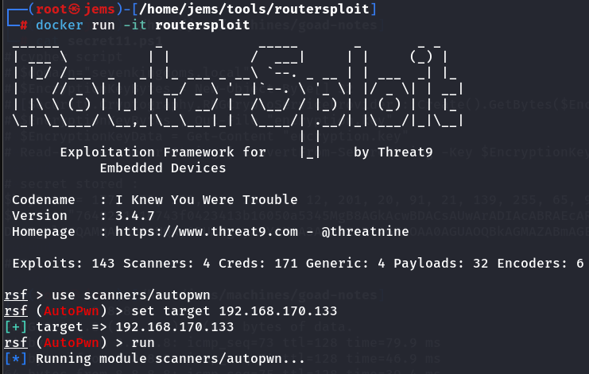
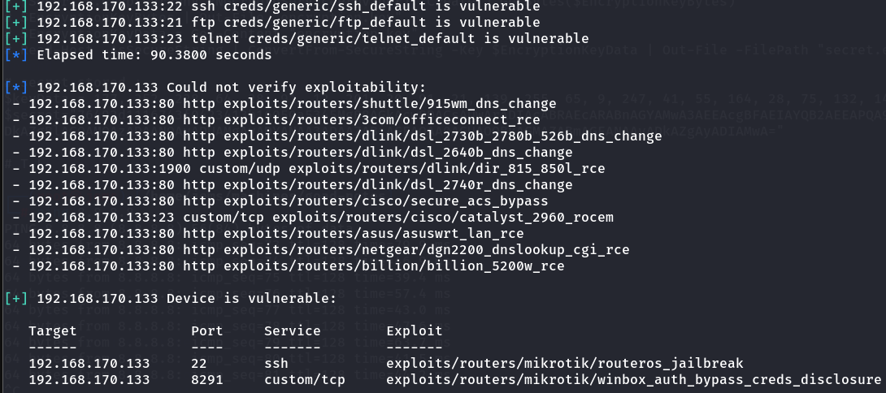
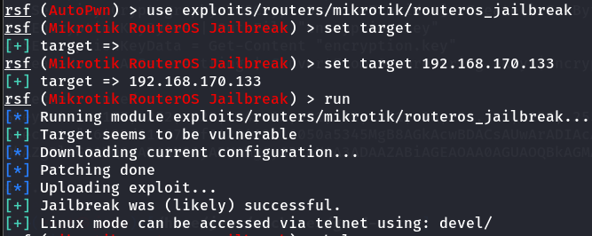

CCTV INVESTIGATION
===================================

CamXploit es una herramienta de reconocimiento diseñada para ayudar a investigadores y entusiastas de la seguridad a comprobar si una dirección IP aloja una cámara CCTV expuesta. Escanea los puertos comunes de las cámaras, busca páginas de inicio de sesión, prueba las credenciales predeterminadas y proporciona enlaces de búsqueda útiles para una investigación más profunda.

Link: https://github.com/spyboy-productions/CamXploit

=========================================================================

INSECAM
=======

Esta es una pagina en donde se muestran las camaras que estan siendo expuestas al mundo sin que sus dueños lo sepan.

Link: https://search.censys.io/?q=

=========================================================================

ROUTERSPLOIT
============

Con routersploit podemos encontrar vulnerabilidades en equipos CCTV, routers y otros es un framework tipo metasploit.

Link: https://github.com/threat9/routersploit

=========================================================================

