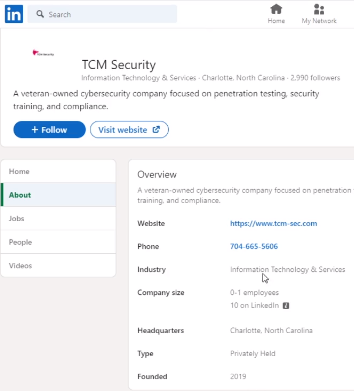
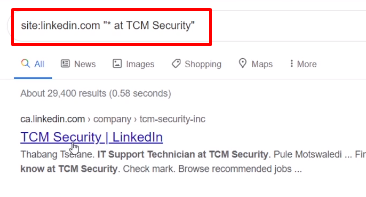
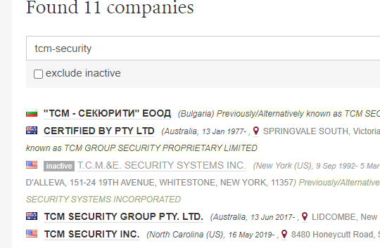
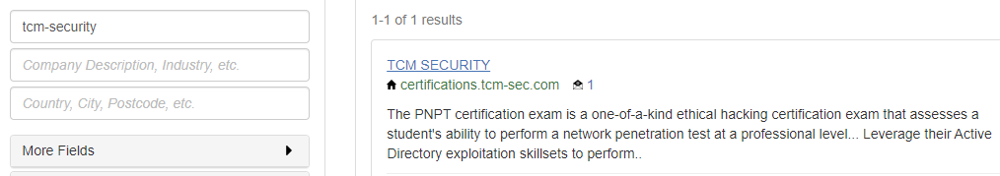
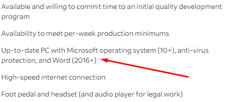

HUNTING BUSINESS
================
Aqui veremos como utilizar google y linkedin para nuestros propositos de recolectar informacion acerca de una empresa y sus dependientes.

En linkedin podemos realizar una busqueda y obtener mucha informacion acerca de la empresa y las personas que estan relacionadas a la misma.

=========================================================================

OPEN CORPORATES
===============
Tambien podemos utilizar https://opencorporates.com/ para obtener informacion de las mismas empresas.

=========================================================================

También tomamos en cuenta que en los avisos de trabajo muchas empresas revelan las tecnologias que tienen.
Link: https://www.indeed.com/jobs

