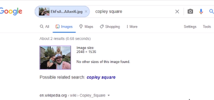
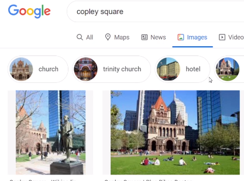

UBICACIONES GEOGRAFICAS
=======================
Cuando no podemos reconocer la ubicacion, no tenemos datos EXIF u otra informacion que podamos utilizar solo nos queda poder identificar los pequeños detalles que nos puede brindar la imagen para poder observar carteles, nombres de calles, hoteles etc. que nos puedan brindar datos de la ubicacion, un vez con esta informacion podemos buscar estos lugares o tambien si es posible recortarlos y ponerlos en los buscadores de imagenes de google o bing para ir armando el origen de la imagen central.

=========================================================================

