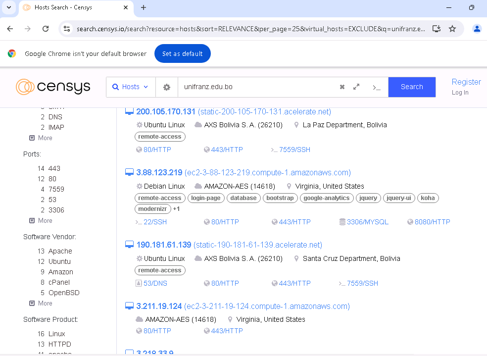

RECOPILAR INFORMACION DE LA VICTIMA
===================================
Podemos crear un link que nos permita recolectar la informacion del click realizado.

Link: https://canarytokens.org/nest/generate

Creamos un nuevo web bug.

Ponemos un correo (puede ser temporal) para que nos llegue el aviso del click y la informacion del request.

Una vez que la victima realice el click recibimos la informacion en el correo.

=========================================================================

CENSYS
======

Con CENSYS podemos buscar un dominio y nos da informacion tipo shodan.

Link: https://search.censys.io/?q=

=========================================================================
